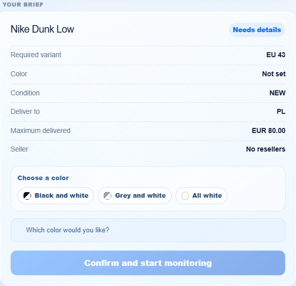
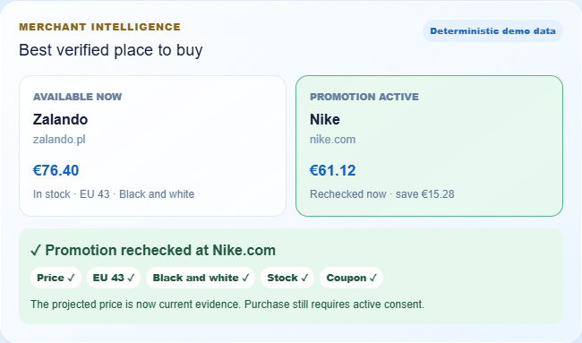
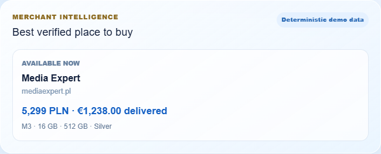
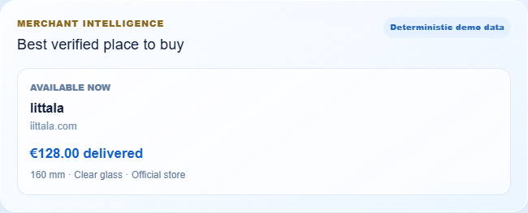

# AI Shopping Assistant

Integrated alert slice for the OpenAI × START Warsaw Hackathon Solidgate case. The app interprets and confirms a natural-language brief, matches deterministic merchant events through the real staged catalog matcher, applies the trust-core services, stores audit records in SQLite, and renders the rejection-to-alert journey.


https://github.com/user-attachments/assets/b5f570c7-f219-4ea4-9295-819b8d232f28


## Start locally

Requirements: Node.js 20+ and pnpm 11.

```bash
nvm use
corepack enable
corepack install --global pnpm@11.7.0
pnpm install
pnpm db:reset
pnpm dev
```

The repository includes `.nvmrc` pinned to Node.js 22.22.2. If `pnpm` is missing or the shell reports Node.js 18, run the three bootstrap commands above before installing dependencies.

Open <http://localhost:3000>, interpret and confirm a brief (the complete example is ready to use), then open the details view. You may explicitly activate the scoped one-time purchase mandate before stepping through five deterministic simulator events. The timeline rejects a wrong model, an above-cap GBP offer, and an invalid-coupon offer, alerts on the EUR 76.40 offer, and performs one simulated purchase only after the final fresh low-stock update satisfies the active mandate. Without consent, the alert journey remains unchanged.

The details view also supports pausing, resuming, and revoking monitoring. Each lifecycle transition creates an immutable request version; pausing or revoking prevents event processing and immediately revokes active purchase consent.

For the curated demo, choose one of the three presentation briefs, confirm the interpreted hard requirements, and step through its automatically selected deterministic scenario.

No environment file or OpenAI API key is needed for the deterministic text flow. Deterministic adapters and a repository-local SQLite path are the defaults. To enable the optional voice controls, copy `.env.example` to `.env.local` and configure `OPENAI_API_KEY`.

## Demo scenarios

[przypadki.txt](przypadki.txt) is the manual demo runbook. It contains three copy-ready shopping briefs and the recommended presentation order. Merchant names, prices, promotions, and virtual time are deterministic demo data; a future promotion never authorizes an automatic purchase.

### 1. Nike Dunk Low — clarification and scheduled promotion

> Nike Dunk Low, EU 43, under EUR 80 delivered to Poland. New only, no resellers. Notify me once.

The missing color deliberately triggers a clarification. Choose **Black and white**, confirm monitoring, and compare Zalando at **EUR 76.40 now** with Nike.com at **EUR 61.12 in 10 days**. Select **Wait 10 days**, then **Advance +10 days** to recheck price, EU 43 size, color, stock, and coupon before any action.

| Color clarification | Promotion recheck |
| --- | --- |
|  |  |

To skip clarification, include `black and white` in the initial brief.

### 2. MacBook Air M3 — landed-price conversion

> Apple MacBook Air 13-inch M3, 16 GB RAM, 512 GB SSD, silver, under EUR 1300 delivered to Poland. New only, no resellers. Notify me once.

Confirm the complete brief to show the verified Media Expert offer. The card preserves the hard configuration and presents **5,299 PLN** as **EUR 1,238.00 delivered**, making the landed-price comparison explicit.



### 3. Iittala Aalto Vase — official-store match

> Iittala Aalto vase, 160 mm, clear glass, under EUR 140 delivered to Poland. New only, no resellers. Notify me once.

Confirm the brief to show the official `iittala.com` offer at **EUR 128.00 delivered**, with the required **160 mm clear-glass** variant visible on the evidence card.



For the clearest live presentation: run Nike first, show the clarification and virtual-time recheck, click **New chat**, then run MacBook. Use Iittala as the short final example.

## OpenAI voice

With `VOICE_INTAKE_ENABLED=true` and `OPENAI_API_KEY` configured, the chat supports microphone dictation through `/api/voice/transcribe` and AI-generated speech through `/api/voice/speech`. The defaults are `gpt-4o-mini-transcribe`, `gpt-4o-mini-tts`, and the `marin` voice; both model IDs are configurable in `.env.local`.

Dictation always lands in the textarea for review before it becomes a chat turn. Voice can propose a draft, but it cannot confirm hard constraints, activate a purchase mandate, or bypass the existing non-voice confirmation button. Set `VOICE_INTAKE_ENABLED=false` to remove audio without changing the text journey.

For the realtime Scout companion, copy `.env.example` to `.env.local` and configure `OPENAI_API_KEY` and `OPENAI_MODEL`. `OPENAI_REALTIME_MODEL` defaults to `gpt-realtime-2.1-mini`.

Scout can be invoked with **Call Scout**, **Talk to Scout**, the `/voice` command, or `Alt+V`. The browser requests microphone permission and connects over WebRTC using a short-lived token minted by the server; the project API key is never sent to the browser. Spoken intake updates the same structured request review as typed intake, and monitoring still requires the explicit **Confirm hard requirements** button.

The focused demo selector contains three complete journeys: Nike Dunk Low EU 43, Iittala Aalto Vase 160 mm clear, and MacBook Air M3 13-inch with 16 GB RAM and 512 GB SSD. Each timeline first rejects a specified near match, then exposes a valid offer. A five-step workflow explains the agent's work and unlocks a one-time simulated payment only for the latest eligible alert after explicit UI consent. No payment credentials or real funds are used.

## Commands

| Command | Purpose |
| --- | --- |
| `pnpm dev` | Run the local Next.js app |
| `pnpm build` | Create a production build |
| `pnpm lint` | Check ESLint rules and Next.js conventions |
| `pnpm typecheck` | Run strict TypeScript checks |
| `pnpm evaluate:trust-core` | Run the reproducible manual Person A evaluation and boundary report |
| `pnpm db:generate` | Generate a Drizzle migration from the schema |
| `pnpm db:migrate` | Apply migrations to the configured SQLite database |
| `pnpm db:reset` | Recreate a clean local database |
| `pnpm db:seed` | Store the headline shopping request |
| `pnpm verify` | Run lint, strict type-checking, and a production build |

## Architecture and ownership

Dependencies point inward. `src/domain` contains Zod contracts and service interfaces and may not import Next.js, OpenAI, persistence, application, or simulator code. Evaluation-only ground-truth labels live outside runtime source under `evaluation/`.

- Person A / `feat/trust-core`: authoritative pricing, verification, policy, notifications, audit, and evaluations.
- Person B / `feat/intelligence-simulator`: brief interpretation, catalog, matching, AI adapters, simulator, and scenarios.
- Person C / `feat/product-integration`: application orchestration, SQLite/Drizzle, UI, and end-to-end integration.

The running app uses the real Person A trust-core services and Person B brief/matching services. Fixture adapters remain only as isolated checkpoint helpers. The merchant feed itself stays deterministic and simulated by design so the demo is repeatable.

Per the repository guidance, this project does not contain automated tests. Validate work with `pnpm verify`, `pnpm evaluate:trust-core`, database reset/seed commands, and a manual reset-and-step smoke check in the browser.

See [docs/BASELINE_DECISIONS.md](docs/BASELINE_DECISIONS.md) for the frozen scenario semantics.
Person B's catalog disclosures and manual verification record are in [docs/DEMO_CATALOG.md](docs/DEMO_CATALOG.md) and [docs/PERSON_B_VERIFICATION.md](docs/PERSON_B_VERIFICATION.md).
